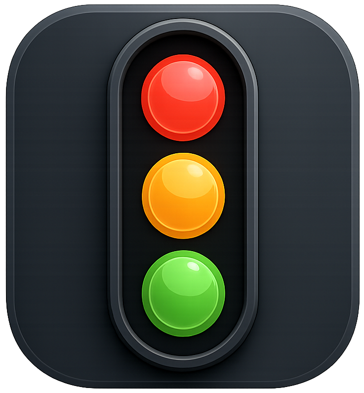
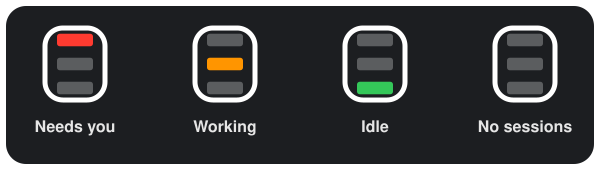

<p align="center">
  
</p>

<h1 align="center">Hive Light</h1>

<p align="center">A native macOS menu-bar traffic light for your Claude Code sessions — see what needs you, at a glance.</p>

<p align="center">
  <a href="LICENSE"></a>
  
  
  <a href="https://github.com/fr1j0/hive-light/releases"></a>
  
</p>

> ### hive light
> **/ˈhaɪv ˌlaɪt/** — *noun*
>
> **1.** the single glow by which a colony of many independent workers can be read as one
> organism; the state of the whole, never of any one bee.
>
> **2.** the glance a beekeeper gives the hive — the work is left to happen on its own, and
> the keeper steps in only when something truly needs them.
>
> **3.** *(software, macOS)* a menu-bar light that distills every Claude Code session on your
> Mac — projects as cells, sessions within them, subagents fanning out like foragers — into
> one traffic light: **red** when a session needs you, **orange** while the hive hums,
> **green** when all is quiet.
>
> *A hive is never managed one bee at a time.*

## Overview

Hive Light watches every Claude Code session on your Mac and distills them into a single traffic light in the menu bar. One glance tells you whether an agent is waiting on you, still working, or done — no alt-tabbing through terminals to find out.

## At a Glance

<p align="center">
  
</p>

The menu-bar icon reflects the most urgent state across all your sessions:

| Lamp | Meaning | Motion |
|------|---------|--------|
| &nbsp;Red | A session needs you: a question, permission prompt, or review request is waiting | Blinks (question) · steady (permission, review) |
| &nbsp;Orange | At least one session is actively working | Gentle pulse |
| &nbsp;Green | Sessions are idle; nothing needs you | Steady |
| &nbsp;Hollow | No live sessions | Steady |

Red always wins the aggregate, so a single waiting session is never buried behind busy ones. Motion is reserved for the menu bar — a blink to pull your eye when a session needs a reply, a soft pulse while work is underway — and state is conveyed by lamp position as well as color.

## The Dropdown

Click the icon for the full picture:

- A hive-voiced header — *Hive is humming* over the factual counts
  (`2 working · 1 idle`) — whose lamp halo breathes while work is underway.
- Sessions grouped by project, in a stable order — a status change recolors a
  row, never moves it (or sorted by opening order, your pick). Each card:
  status dot, Git branch label, context gauge, model badge, a live
  elapsed-state timer, and — when a session is blocked — the actual question
  or permission request it's waiting on.
- Running task-driven sessions show what they're on: the current tracker task
  with progress (`Task 6: docs + quality gate · 5/7 tasks`), recently
  completed tasks struck through, and a `+N earlier` disclosure that unfolds
  the full history.
- Running sessions with parallel subagents show them as collapsible rows
  inside the card, nested under the task that owns them.
- Click a card to jump to that session's terminal.
- An opt-in usage strip — 5-hour and weekly windows — that opens a full
  usage view with plan limits and per-model daily history.
- Settings flip in place: session activity (tasks + subagents), usage stats
  and plan limits, session sort order, launch at login, needs-you
  notifications, and one-click install or removal of the Claude Code hooks.
- Quit and the running version live in the footer.

## Features

- Native menu-bar app — lightweight, no dock icon, no window.
- Aggregate traffic light across any number of concurrent sessions.
- A distinct traffic-light icon — glowing lamps on a dark plate, hollow sockets
  when unlit — one rendering for both menu-bar themes.
- Per-session context gauge, model badge, and Git branch label.
- Live updates via filesystem events — the display reacts within a fraction of a second.
- Opt-in native notification when a session flips to needs-you — with the actual
  question — click it to jump to that terminal.
- Opt-in usage stats, with plan limits fetched via your Claude Code login.
- Launch-at-login toggle, so the light is always on duty.
- No polling, no telemetry — and no network beyond the opt-in plan-limits fetch.
- Zero configuration beyond a one-click hook install.

## How It Works

Hive Light integrates with Claude Code through a small hook shim. On each Claude Code hook event, the shim writes that session's state to `~/.hive-light/sessions/`. The app watches that folder and updates its display the moment anything changes.

For the full technical design, see the specs under [`docs/superpowers/specs/`](docs/superpowers/specs/).

## Installation

### Homebrew (recommended)

```bash
brew tap fr1j0/hive-light
brew trust fr1j0/hive-light   # newer Homebrew requires trusting third-party taps
brew install --cask hive-light
```

Update any time with `brew upgrade --cask hive-light`. There is no auto-update or in-app update check — updates only arrive through Homebrew (or by downloading a newer release manually).

### From GitHub Releases

Download the latest `.app` from [GitHub Releases](https://github.com/fr1j0/hive-light/releases) and verify the published SHA-256 checksum to confirm authenticity.

> **Note — unsigned interim builds:** releases are currently ad-hoc signed while Apple notarization for the team is pending, so on first launch Gatekeeper may report the app as *"damaged and can't be opened"*. Clear the quarantine flag and launch again:
>
> ```bash
> xattr -dr com.apple.quarantine "/Applications/Hive Light.app"
> ```

## First Run

1. Launch Hive Light — a traffic-light icon appears in the menu bar.
2. Click the icon and choose **Install Claude Code hooks**. This safely merges the hook entries into `~/.claude/settings.json`.
3. Your next Claude Code prompt lights up the menu.
4. **Remove Claude Code hooks** cleanly undoes the change at any time.

Questions or a light that won't turn on? See the [FAQ](docs/FAQ.md) and [Troubleshooting](docs/TROUBLESHOOTING.md).

## Build from Source

Requires Swift 5.9+ and macOS 13+.

```bash
swift build -c release          # build the app and hook binaries
swift test                      # run the test suite
bash scripts/package-app.sh     # produce dist/Hive Light.app
```

## Security & Trust

Hive Light edits your settings and runs on every Claude Code hook, so it is fully open source and auditable — read the source and verify it for yourself. Current releases are interim builds **without** Developer ID signing or notarization (pending Apple enabling notarization for the team); until that lands, authenticity rests on the published SHA-256 checksums and the auditable source. Once notarization is enabled, official builds will be signed and notarized, removing the Gatekeeper warning and guaranteeing the binary has not been tampered with.

Install only from the official [Releases](https://github.com/fr1j0/hive-light/releases), and verify the published SHA-256 checksum before running.

Everything stays on your machine — no telemetry, and no network beyond the opt-in plan-limits fetch; see [PRIVACY.md](PRIVACY.md) for exactly what the app touches. To report a vulnerability privately, see [SECURITY.md](SECURITY.md). Contributions welcome — see [CONTRIBUTING.md](CONTRIBUTING.md).

## License & Trademark

Licensed under [Apache-2.0](LICENSE). The name "Hive Light", logo, and icon are **not** licensed under Apache-2.0 — see [TRADEMARK.md](TRADEMARK.md) for details.

"Claude" is a trademark of Anthropic. This is an independent community project, not affiliated with or endorsed by Anthropic.
